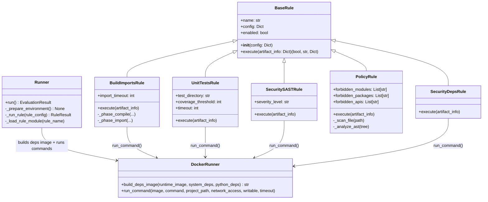

# Class diagram — Rules

### Notes
- In each rule file, the concrete class is named `Rule` (loaded dynamically), but conceptually it maps to the rule type shown above.
- `artifact_info` is the shared context passed from `Runner` → each `Rule.execute(...)` and contains keys like `docker_runner`, `deps_image`, `absolute_path`, `network_access`, etc.
