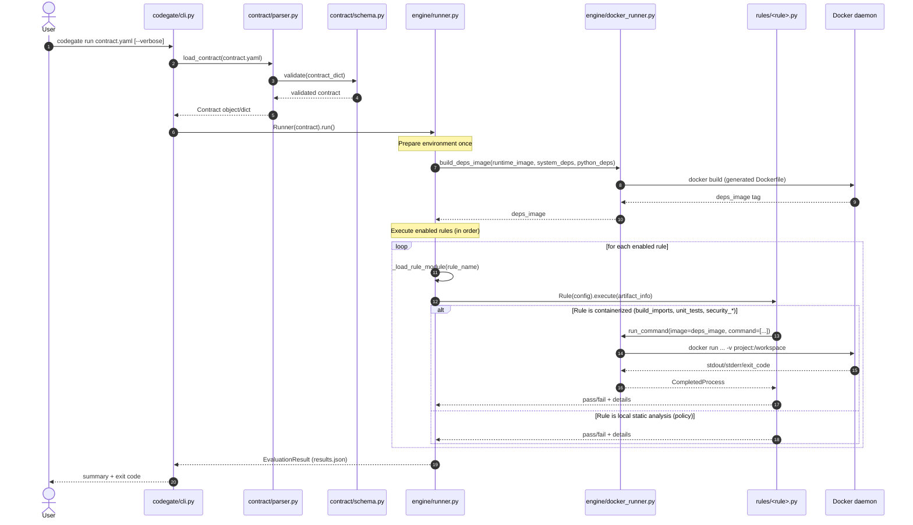

# Sequence diagram — `codegate run`

### Notes
- The **deps image** is built a single time from the contract’s `Environment` and `project.python_dependencies`.
- Each docker-based rule runs inside a container using that pre-built deps image.
- The `policy` rule is static analysis and runs locally (no container required).
